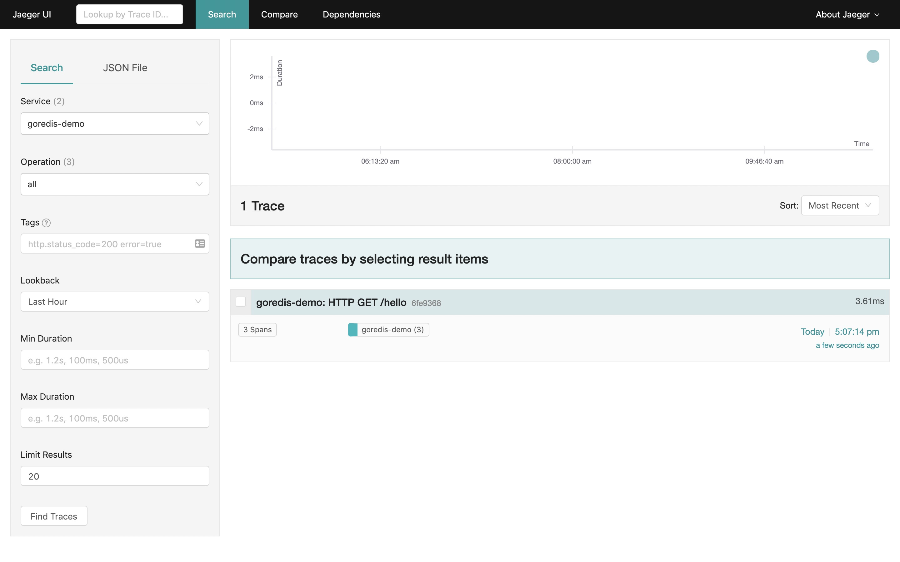
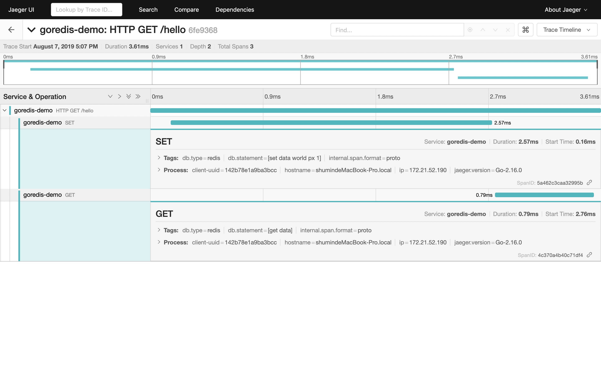

# goredis
a middleware for goredis to use opentracing

```go
import (
	"net/http"

	"github.com/go-redis/redis/v7"

	apmgoredis "github.com/severgroup-tt/goredis"
)

var redisClient *redis.Client // initialized at program startup

func handleRequest(w http.ResponseWriter, req *http.Request) {
	// Wrap and bind redisClient to the request context. If the HTTP
	// server is instrumented with Elastic APM (e.g. with apmhttp),
	// Redis commands will be reported as spans within the request's
	// transaction.
	client := apmgoredis.Wrap(redisClient).WithContext(req.Context())
	...
}
```

Example: [goredis-example](./examples)




